

# Typografia webových stránok

Adam Hruška, Viktória Lučanská, Alex Novák

# Obsah
- [Typografia webových stránok](#typografia-webových-stránok)
- [Obsah](#obsah)
  - [**Typy písma a texty**](#typy-písma-a-texty)
    - [**Pätkové vs bezpätkové**](#pätkové-vs-bezpätkové)
      - [**Serifové (pätkové/Serif)**](#serifové-pätkovéserif)
      - [**Bezserifové (bezpätkové/Sans Serif)**](#bezserifové-bezpätkovésans-serif)
    - [**Proporcionálne vs neproporcionálne písmo**](#proporcionálne-vs-neproporcionálne-písmo)
    - [**Vhodný počet fontov na webstránke**](#vhodný-počet-fontov-na-webstránke)
    - [**Dlhé vs krátke texty**](#dlhé-vs-krátke-texty)
    - [**Maximálna úroveň nadpisov**](#maximálna-úroveň-nadpisov)
    - [**Pravidlá na písma**](#pravidlá-na-písma)
      - [**Zroumiteľnosť**](#zroumiteľnosť)
      - [**Čítateľnosť**](#čítateľnosť)
      - [**Kontext**](#kontext)
  - [**Rozloženie a prvky stránky**](#rozloženie-a-prvky-stránky)
    - [**F-pattern vs Z-pattern**](#f-pattern-vs-z-pattern)
      - [**F-pattern**](#f-pattern)
      - [**Z-pattern**](#z-pattern)
    - [**Single Page Application - SPA**](#single-page-application---spa)
    - [**Osobné portfólio vs e-shop**](#osobné-portfólio-vs-e-shop)
    - [**Klikateľné logo stránky**](#klikateľné-logo-stránky)
    - [**Slider vs Banner**](#slider-vs-banner)
      - [**Slider**](#slider)
  - [**Typografia webu vs tlače**](#typografia-webu-vs-tlače)
  - [**Responzívny web design**](#responzívny-web-design)
    - [**Pravidlá responzívneho web designu**](#pravidlá-responzívneho-web-designu)
      - [**Relatívne jednotky**](#relatívne-jednotky)
    - [**Flexibilné mriežky**](#flexibilné-mriežky)
    - [**Nevyužívame „nespratný“ obsah**](#nevyužívame-nespratný-obsah)
    - [**Rozdelenia obsahu**](#rozdelenia-obsahu)
    - [**Upravené prvky**](#upravené-prvky)
    - [**Interaktívne prvky**](#interaktívne-prvky)
    - [**Prispôsobivosť stránky**](#prispôsobivosť-stránky)
    - [**Začínať od najmenšieho**](#začínať-od-najmenšieho)
    - [**Testovať**](#testovať)
  - [**Optimalizácia obrázkov**](#optimalizácia-obrázkov)
    - [**Rozlíšenie**](#rozlíšenie)
    - [**Veľkosť**](#veľkosť)
    - [**Použitie CDN**](#použitie-cdn)
  - [**Farby a štýly**](#farby-a-štýly)
    - [**UX**](#ux)
    - [**UI**](#ui)
    - [**UX vs UI**](#ux-vs-ui)
    - [**UX dizajn**](#ux-dizajn)
    - [**UI dizajn**](#ui-dizajn)
  - [**Základné pojmy ktoré sa používaju pri typografii webu**](#základné-pojmy-ktoré-sa-používaju-pri-typografii-webu)
    - [**Veľkosť**](#veľkosť-1)
    - [**Leading**](#leading)
    - [**Kerning**](#kerning)
    - [**Measure**](#measure)
    - [**Hierarchia**](#hierarchia)
    - [**Farba**](#farba)
    - [**Tlačidlá**](#tlačidlá)
  - [**Ako na mobile ?**](#ako-na-mobile-)
    - [**Vypustenie obrázkov**](#vypustenie-obrázkov)
    - [**Zjednodušenie webu**](#zjednodušenie-webu)
    - [**Prehľadnejšia navigácia**](#prehľadnejšia-navigácia)
    - [**Primerané efekty a decentný dizajn**](#primerané-efekty-a-decentný-dizajn)
    - [**Čo je podstatné a čo nie ?**](#čo-je-podstatné-a-čo-nie-)
    - [**Kde zobrazujeme to dôležité a kde to menej podstatné ?**](#kde-zobrazujeme-to-dôležité-a-kde-to-menej-podstatné-)
      - [**Hlavná stránka**](#hlavná-stránka)
      - [**Podstránka**](#podstránka)
  - [**Stránka čo ide s trendami**](#stránka-čo-ide-s-trendami)

## **Typy písma a texty**

### **Pätkové vs bezpätkové**

Typy fontov najčastejšie zaraďujeme na **pätkové a bezpätkové**. **Pätkové písma** majú tzv. Pätky čiže serif, čo sú detaily, ktoré rozširujú ukončenie písmena. Najznámejším zástupcom je font Times New Roman. **Bezpätkové fonty** žiadne rozšírenie nemajú, sú jednoduchšie a technickejšie. Pätky by sme márne hľadali napríklad u známeho fontu Arial.

#### **Serifové (pätkové/Serif)** ####

Ide o najstarší typ písma. Pochádza z rímskych rezbárskych diel a existujú dve teórie, prečo mali Rimania na písmenách **pätky**.

Prvý hovorí, že pri vyrezávaní písmen do kameňa kamenosochári nevyhnutne vytvárali **pätky**, pričom sledovali obrysy písmen.

Druhá teória naznačuje, že použitie **pätiek** bolo zámerné a že sa používali na úpravu koncov čiar.

V každom prípade sa **písmená** s **pätkami** stali štandardnými písmenami a používali sa po stáročia, takže keď Gutenberg navrhol tlačiarenský lis s pohyblivým písmom, knihy boli vytlačené písmenami s pätkami.

**Pätkové písma** sa kvôli svojmu pôvodu spájajú so starými a tradičnými, ale to neznamená, že sa už nepoužívajú.

Dokumenty určené na tlač by mali byť vytlačené prevažne **písmom pätkovým**, hoci nejde o dogmu. Má sa za to, že serify pri čítaní na papieri uľahčujú orientáciu v texte a fungujú ako záchytné body pre oko. Taktiež by sa malo **pätkové písmo** používať pri vytváraní blogov.

Obsahuje serify (pätky), na monitoroch s menšou hustotou pixelov na palec sa horšie čítajú, preto by sa mali použiť na väčšie písmo, napr. na nadpisy

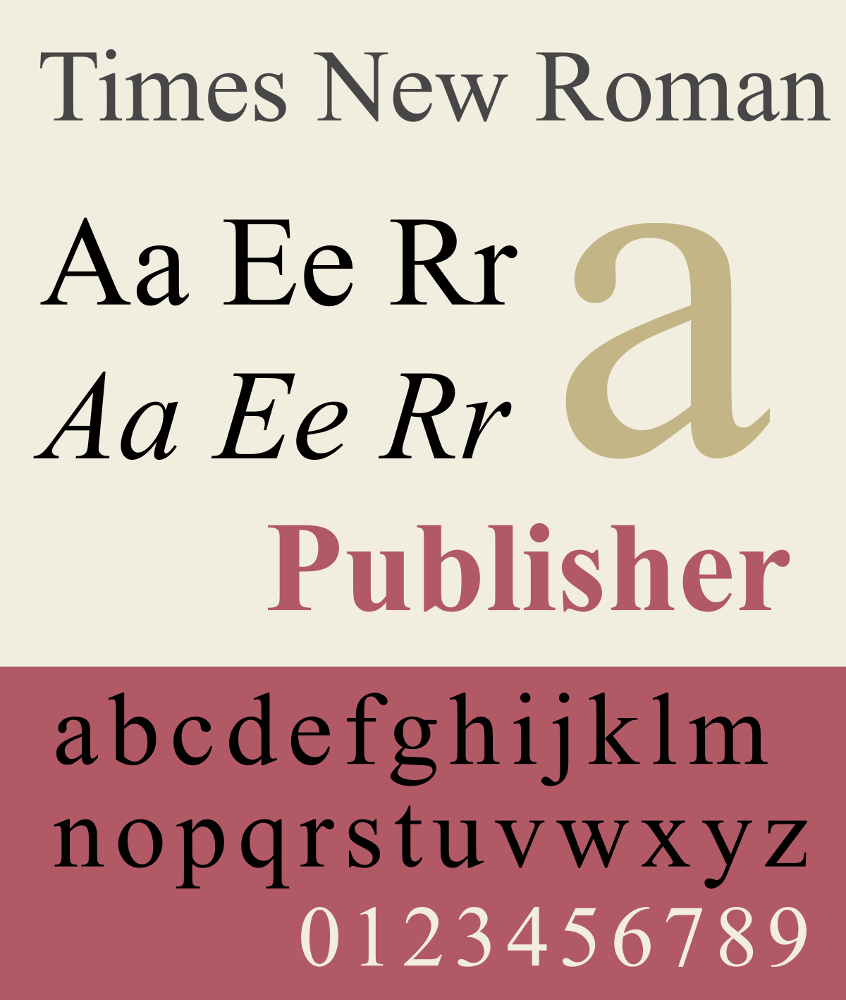

#### **Bezserifové (bezpätkové/Sans Serif)** ####
Keď sa minimalizmus stal populárnejším, objavila sa potreba jednoduchších a čistejších fontov.

Na scénu vstúpili **bezpätkové fonty**. Je vhodné ich použiť na všetky typy textov. 

Tieto písma, ako už bolo spomenuté, **nemajú pätky** a vyzerajú modernejšie a elegantnejšie. Rovnako ako **pätkové písma**, aj **bezpätkové písma** majú variácie v závislosti od obdobia, kedy boli vyrobené, a ich vzhľadu.

Prvýkrát sa objavili na začiatku 19. storočia. Na prvý pohľad zamračené, v súčasnosti sa používajú **oveľa viac** ako pätkové písma. Ich elegantný vzhľad dokonale ladí s moderným webovým dizajnom a pokiaľ ide o webové články, ich absencia pätiek umožňuje čistejší text a **zvýšenú čitateľnosť**.

**Bezpätkové písmo** je vhodné najmä pre webstránky alebo digitálnu grafiku, kde nie je potrebné čítať veľa textu. Bezpätkové písmo má aj svoje uplatnenie pri tlači. Hodí sa pre nadpisy, podnadpisy, názvy kapitol alebo pätičky stránok.

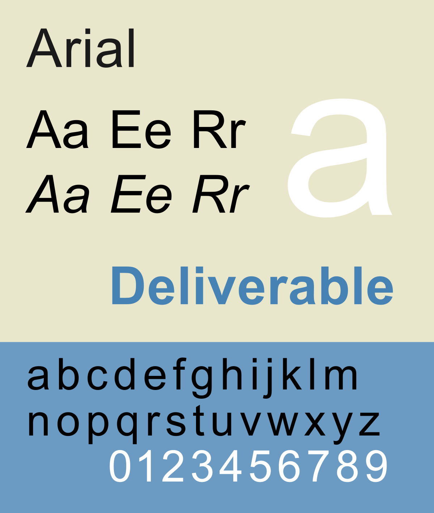

### **Proporcionálne vs neproporcionálne písmo**

Menej zaužívaným delením je označenie typu písma na **proporcionálne a neproporcionálne** písmo, ktoré má vyčlenenú rovnakú šírku všetkých znakov bez ohľadu na ich rozmery. V prípade, ak hovoríme o písme **proporcionálnom**, medzi jednotlivými písmenami vznikajú prirodzene široké medzery, ktoré však nie sú rovnaké. Zohľadňujú práve prirodzené **proporcie** (šírky) hlások. Druhým typom je písmo **neproporcionálne**. Tu platí, že každému písmenu prináleží rovnaká šírka bez ohľadu na jeho **proporcie**.

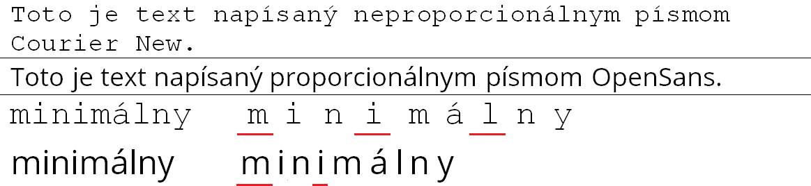

### **Vhodný počet fontov na webstránke**

Čo sa týka množstva rozličných fontov na webstránke, odporúča sa maximálne 2 až 3 fonty. Jeden by mal byť primárne určený na nadpisy, druhý zasa pre ostatný text, tlačidlá, a podobne. Čím menej fontov na stránke použijeme, tým lepší efekt vytvorí stránka na zákazníka/návštevníka. Odporúča sa radšej použiť dve viac-menej odlišné rodiny písma/fontov, ktoré sa nebudú "biť" a vytvárať na stránke chaos. Ideálne je meniť ich hrúbku, veľkosť a stránka bude pôsobiť usporiadane, prehľadne a čisto. 

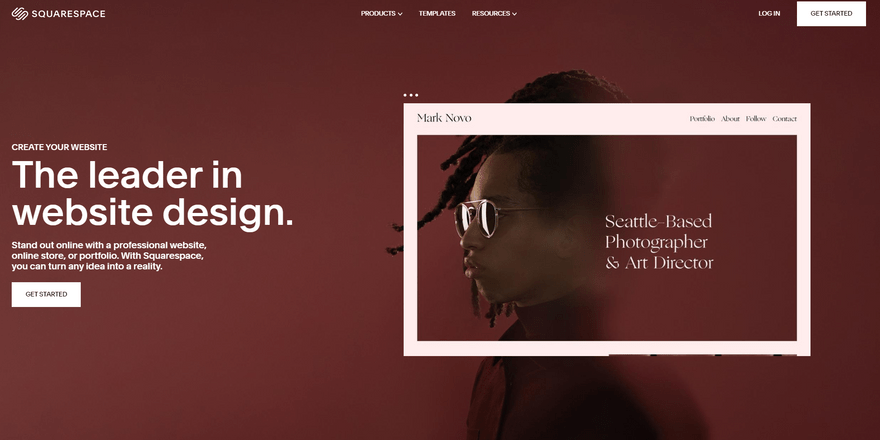

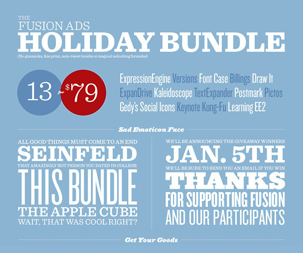

### **Dlhé vs krátke texty**

Nielen na webstránkach, ale aj plagátoch, reklamných banneroch a iných grafických dizajnoch by malo platiť, čím menej textu, tým lepšie. 

Veľké množstvo zbytočného textu pôsobí na prezerajúci subjekt chaoticky a hlavne odrádzajúco. Účelom textu je podať čo najväčšie množstvo základných informácií jednoducho zhrnutých do krátkych slov/viet alebo odseku, ktoré sú postačujúce na zachytenie prezentujúcej informácie. 

Odporúča sa používať jednoduché hovorové frázy, nesnažiť sa, respektíve obmedziť množstvo odborných termínov. Samozrejme, pokiaľ sa nejedná o stránku/informačný obsah, ktorého účelom je poskytnúť veľké množstvo informácií. 

Maly by sa použiť krátke vety, bez zbytočných "omáčok" okolo. Používnaie krátkych viet a hovorových slov, zvyšuje záujem o text alebo informáciu až o 62%. Základom textu je vystihnúť fakty. 

Dlhý text sa na webových stránkach nemá pužívať. Výnimkou sú samozrejme blogy alebo informačné stránky ako napríklad "wikipedia".

### **Maximálna úroveň nadpisov**

Maximálna úroveň nadpisov pužitých na stránke je 6 úrovní celkovo. Začínajúc od hlavného nadpisu, čo je H1, následuje podnadpis, čo je H2, ďalej poznáme tzv. podnadpisy nižších úrovní tj. H3, H4, H5, H6.

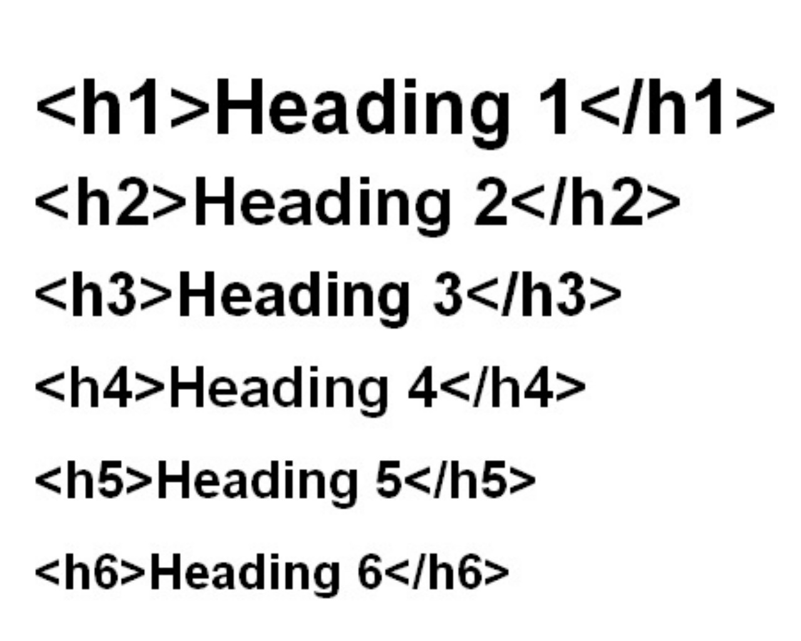

Do nadpisov väčšinou zhrnieme, čo nasleduje v samotnom texte pod ním. Preto aj vyhľadávače analyzujú nadpisy a snažia sa z nich pochopiť, o čom obsah je a ako je štruktúrovaný. Dôležitosť nadpisov pre SEO je prakticky neporovnateľná s "title". Je tu ale niekoľko dôvodov, prečo používať nadpisy na stránkach správne:

- Nadpisy majú vyššiu váhu v Google algoritmoch ako obyčajný text.
- Google môže za istých okolností zobraziť nadpisy vo výsledkoch vyhľadávania.
- Pri hlasovom vyhľadávaní môže Google hľadať podobnú otázku v nadpise na vašej stránke, ako je vyhľadávaná. Následne môže hľadajúcemu prezentovať vašu odpoveď, ktorá sa nachádza pod daným nadpisom.
- Prístupnosť a použiteľnosť web stránok. Nevidiacim čítačka prezradí, ktorá úroveň nadpisu to je. Navyše sa môžu pomocou nadpisov navigovať bez toho, aby si nechali prečítať celé state zo stránok.

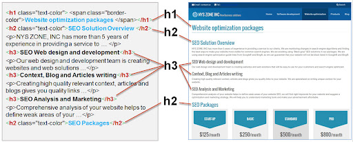

### **Pravidlá na písma**
- *Zrozumiteľnosť*
- *Čítateľnosť*
- *Kontext*

#### **Zroumiteľnosť**

Zrozumiteľnosť sa týka schopnosti čitateľov ľahko porozumieť písmenám alebo znakom. Niektoré typy fontov, ako napríklad Arial alebo Helvetica, sú čitateľnejšie ako iné. Práve preto sú v online svete jednoduché fonty užitočnejšie. Zrozumiteľnosť fontu je priamo previazaná s jeho anatómiou.

Prepracované ozdobné písma a skripty sú často menej čitateľné a vyžadujú si od ľudí viac pozornosti. Veľa dizajnérov sa snaží dosiahnuť atraktívny vizuál práve tým, že použije “fancy” okrasný font, čím v konečnom dôsledku zníži čitateľnosť vizuálu.

#### **Čítateľnosť**

Čitateľnosť definuje, ako ľahko sú slová v blokoch textu čitateľné. Je dôležité zamerať sa na detaily a dbať na kombináciu čitateľnosti fontu a zrozumiteľnosti jeho znakov, pretože samotný font bude vo veľkej miere rozhodovať o čitateľnosti vašej stránky.

Faktory ovplyvňujúce veľkosť čítateľnosť písma na webstránke sú najmä:
- veľkosť písma 
- dĺžka riadku
- zarovnanie textu
- riadkovanie
- vzdialenosť medzi písmenami
- farba písma
- farba pozadia písma 

#### **Kontext**

**Kontext** je základný konštrukčný prvok komunikácie a obsahu, na ktorý sa často zabúda. V skratke ide o text z pohľadu obsahu. Hlavným faktorom pri práci s textom je výber vhodného fontu. Výber vhodného fontu závisí na vašom obsahu, cieľovej skupine a emócii, ktorú chcete vyvolať.

- **Červená** alebo **čierna farba** textu a veľké písmená v nadpisoch motivujú k akcii a pôsobia naliehavo. Preto sú vhodné napríklad pre bannerovú reklamu. Výnimkou však môže byť, ak potrebujete vzbudiť pocit pohodlia. Vtedy môže byť vhodnejšia iná farba, napríklad modrá.
- **Ružová farba** môže vyvolať pocit ľahkosti, ale má aj svoj potenciálne kontroverzný význam. Niektorí ľudia spájajú ružovú so slabosťou, alebo s určitými politickými postojmi.
- **Žltá farba** vyvoláva teplo a pocit voľnosti, pretože si ju zvykneme spájať so slnkom.
- **Oranžová farba** je často spájaná s finančnými inštitúciami a zľavami.
- **Zlatá farba** sa často spája s bohatstvom, silou, kvalitou alebo luxusom niekedy sa považuje za výstrednú.

## **Rozloženie a prvky stránky**

### **F-pattern vs Z-pattern**

Štúdie sledovania očí zistili, že ľudia majú tendenciu používať určité vzory pri skenovaní webových stránok a iného digitálneho obsahu. Dva z najbežnejších vzorov sú **„F-pattern“** a **„Z-pattern“**. Inými slovami, prirodzený pohyb očí návštevníkov, ktorí prídu na webovú stránku, má tendenciu sledovať tvar jedného z týchto písmen.

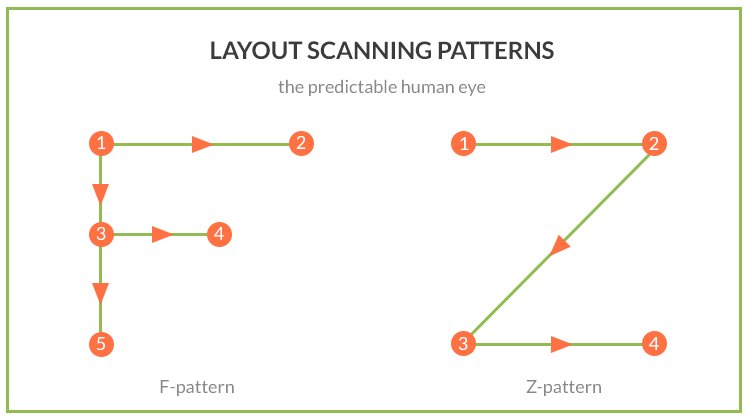

#### **F-pattern**

Zistenia Nielsen Norman Group, zhromaždené v rôznych správach, zostávajú pravdepodobne najcitovanejšími a najužitočnejšími zdrojmi sledovania očí v komunite dizajnérov. Táto správa, ktorá je hlavným výsledkom medzi ich zisteniami, popisuje **F-pattern**:

1. Používatelia **najskôr** čítajú text vodorovným pohybom očí, zvyčajne cez hornú časť oblasti obsahu. Tento počiatočný prvok tvorí hornú lištu **F-pattern-u**.
2. Potom sa používatelia posunú po stránke **o niečo nižšie** a prečítajú si druhý horizontálny obsah, ktorý zvyčajne pokrýva kratšiu oblasť ako predchádzajúci.Tento dodatočný prvok tvorí spodnú lištu **F-pattern-u**.
3. Nakoniec používatelia "naskenujú" **ľavú stranu** obsahu vertikálnym pohybom očí. Tento posledný prvok tvorí kmeň **F-pattern-u**.

**F-pattern** taktiež opisuje spôsob, akým sa budú oči človeka pohybovať po stránke, ktorá je plná textu, vďaka čomu je obzvlášť použiteľný pre blogové stránky a stránky s výsledkami vyhľadávania napr.: vyhľadávanie v prehliadači "Google Chrome", "Mozilla Firefox" a ďalšie.

Dôležité je poznamenať, že oči začnú vždy vľavo hore, kým sa presunú nadol po obsahu stránky. 
Za zmienku taktiež stojí, že **F-pattern-y** nemusia nasledovať tradičné **písmeno „F“** s dvoma horizontálnymi stonkami, ale môžu ich mať hneď niekoľko.

#### **Z-pattern**

Stránky, ktoré sú menej informačne husté, alebo ako píše **Jerry Cao**, „organizované voľnejšie“ v skratke obsahujú oveľa viac prázdnych miest, majú tendenciu vyvolávať pohyby očí, ktoré pripomínajú **písmeno „Z“**. Tento takzvaný **Z-pattern** má mnoho rovnakých charakteristík ako **F-pattern**. Ale ako pán Cao zdôrazňuje, „kde je jednoduchosť prioritou a výzva k akcii (stlačenie tlačidla a p.) je hlavným cieľom“, namiesto **F-pattern-u** na scénu prichádza **Z-pattern**.

Toto zameranie na jednoduchosť robí **Z-pattern** jedinečným a vhodným pre návrh **hlavnej stránky** (landing page), kde chcete, aby jeden jediný pohľad zaujal ľudí a povzbudil ich k istej akcii. Ak chceme využiť **Z-pattern** efektívne, je potrebné umiestniť výzvu na akciu **pozdĺž** cesty **Z-pattern-u**, aby sme sa uistili, že to zákazník uvidí a zaujme ho to. To povedie napr. k väčšiemu počtu objednávok, rezervácií hotelov, atď.

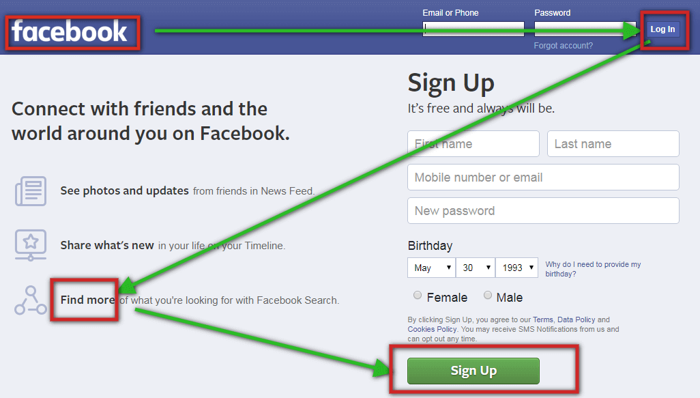

### **Single Page Application - SPA**

**Single page application (SPA)** tvorí len jedna stránka, kde veľa informácií zostáva rovnakých. Mení sa len drobné množstvo vecí, ako stav a pod.

Typický príklad je mailová schránka:

- Keď si napríklad prezeráte svoj e-mail, všimnete si, že počas navigácie sa toho veľa nezmení – bočný panel a hlavička zostávajú pri prechádzaní doručenou poštou nedotknuté.

**SPA** pri každom kliknutí odošle iba to, čo potrebujete, a váš prehliadač tieto informácie vykreslí. Toto sa líši od tradičného načítania stránky, kde server pri každom kliknutí znova vykreslí celú stránku a odošle ju do vášho prehliadača.

Táto metóda na strane klienta kus po kúsku urýchľuje čas načítania stránky, a pre používateľov robí množstvo informácií priamo "na obrazovke", takže nemusia zbytočne čakať na server, na informácie/príkazy/podnety ,ktoré musí server príjmať/spracovávať/odosielať. 

**Single page application** je webová aplikácia alebo webová lokalita, ktorá vytvára interakciu s používateľom dynamickým prepisovaním aktuálnej stránky namiesto načítania celých "háld" nových stránok zo servera.

**Single page application** je skvelým nástrojom ako zaujať a upútať zákazníkov/používateľov... Niektoré príklady SPA, ako sú napríklad Gmail, Mapy Google, AirBNB, Netflix, Pinterest, Paypal a mnohé ďalšie, používajú SPA na vytvorenie plynulého a škálovateľného zážitku.

**SPA** tiež umožňuje oveľa rýchlejší vývoj a budovanie front-endu aj back-endu, keďže väčšina informácií na back-ende sa nemení a nevzniká ani zbytočné spojenie medzi serverom a klientom.

### **Osobné portfólio vs e-shop**

Zatiaľ čo obidve majú úlohu zaujať a niekedy aj "zarobiť", tak na osobnom portfóliu by sme mali použiť v závislosti od nášho zamerania, nie celkom stručné informácie. V podstate pri e-shope, najmä pri opise produktov je dôležité písať "omáčky", ktorým budú samozrejme ľudia rozumieť, to znamená, že úlohou e-shopu nie je poskytnúť len surovú pravdu, ale pravdu, ktorú chceme predať. 

Pri osobnom portfóliu chceme zaujať ľudí, ktorí majú záujem o naše služby ("predávame seba"), je dôležité aby sme na osobnej stránke pôsobili skúsene, odborne, jednoducho, že vieme o čom je reč. 

Pri vytváraní e-shopu je kľúčové zaujať potencionálneho zákazníka ponukou/zľavou/bonusom/akciou... Snažíme sa aj aby dostal informácie, ktoré ho presvedčia o kúpe práve "u nás". V osobnom portfóliu prezentujeme sami seba, aj prostredníctvom omáčok, ale nemusíme  sa držať odborných pojmov a formálnych výrazov.

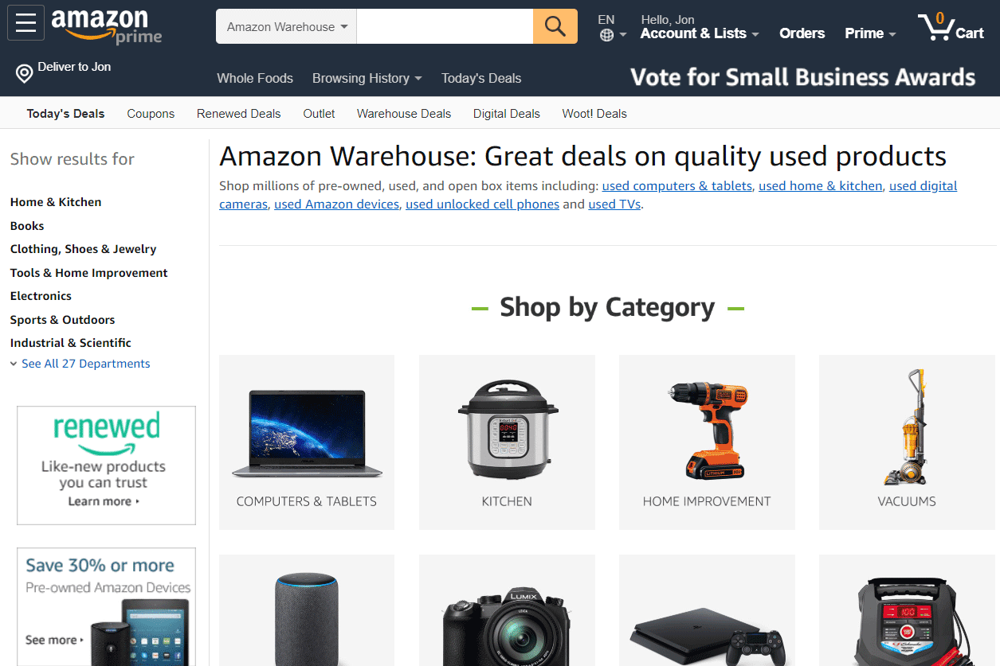

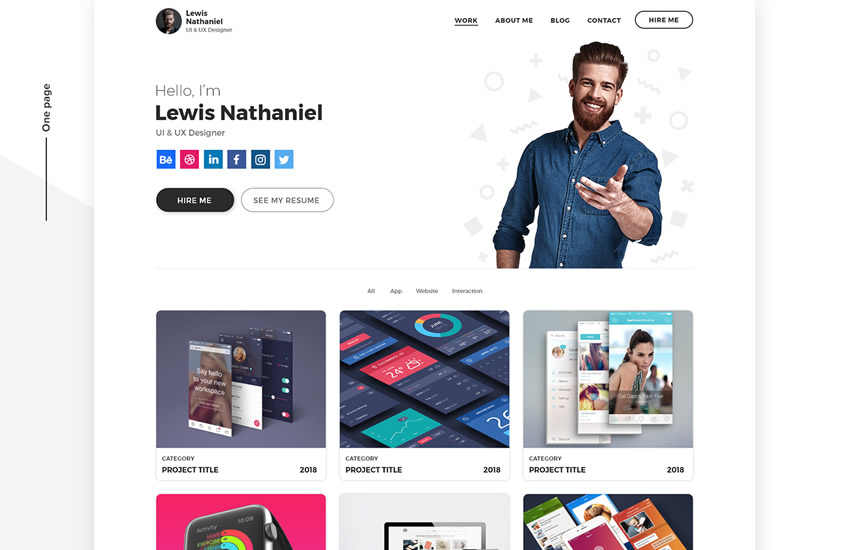

### **Klikateľné logo stránky**

1. *Logá webových stránok by mali odkazovať na domovskú stránku*
    - Toto odporúčanie je dlhoročnou webovou dogmou. Postupom času prostredníctvom pokusov a omylov mnohí ľudia zistili, že kliknutie na logo stránky ich vedie späť na domovskú stránku. Dodržiavanie tohto štandardu na vašom webe znižuje zmätok tým, že vaše používateľské rozhranie zodpovedá očakávaniam používateľov.

    - Odkaz loga na domovskú stránku však nie je úplne bezpečný. Hoci sa jedná o dobre zavedené pravidlo a je chápané všetkými používateľm. V štúdiách použiteľnosti stále pozorujeme ľudí, ktorí sa snažia nájsť odkazy na domovskú stránku inde, najmä ak logá nie sú umiestnené v štandardnom umiestnení vľavo hore alebo vyzerajú ako bežný text.

2. *Umiestnite logo na štandardné miesto: vľavo hore*
   - Logo zarovnané doľava je najznámejšie umiestnenie a používatelia ho tam aj hľadajú.
   - Najnovší výskum ukazuje, že používatelia majú 6-krát väčšiu pravdepodobnosť, že úspešne prejdú na domovskú stránku jedným kliknutím, keď je logo zarovnané doľava, než keď je vycentrované. Jednoduché posunutie loga smerom k pravej strane stránky spôsobilo, že ľudia robili pri hľadaní na stránke chyby.

3. *Logo by sa malo vizuálne odlišovať od ostatného textu na stránke*
   - Či už je logo klikateľné alebo nie, rozhodne by malo vyniknúť a pôsobiť zaujímavým dojmom. 
   - Ak logo vyzerá ako možnosť navigácie alebo ako nadpisy na stránke, môže byť ťažšie ho nájsť a zapamätať si ho.

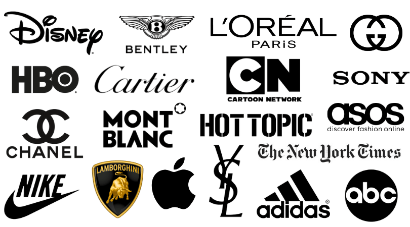

### **Slider vs Banner**

#### **Slider**
Označovaný aj ako **dynamický banner** (Niečo sa na ňom musí hýbať, alebo priamo podnecuje k akcii, napr. prekliknutím). Jednoducho slider je všetko na čo môžete kliknúť, posunúť to, hýbať tým alebo sa to už hýbe samo. Má rovnaký cieľ ako obyčajný (statický) **banner**, ktorého úlohou je vyvolať akciu. Rozdielom však je, že zatiaľ čo na **slider** kliknete a zobrazí sa vám okamžite výsledok vašej akcie, ktorá bola chcená stránkou. Na banner resp. **statický banner** kliknúť nemôžete, nebsahuje klikateľné tlačidlo, využíva sa najmä pri statických tlačených reklamách napr. časopisy, reklamné plagáty, a pod. 

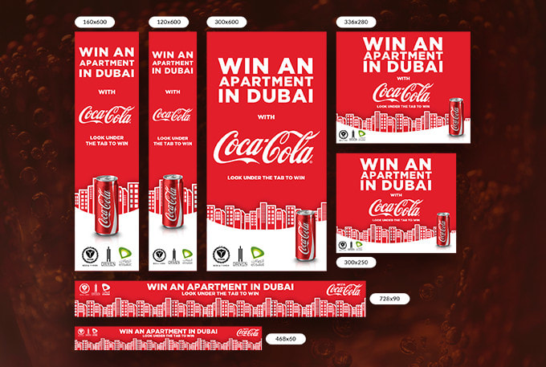
statický banner neobsahuje "action button", len nesie informáciu

Aby som dostal akciu z **statického banneru** musím preto urobiť niečo ja, musím si vyhľadať link, stránku, v podstate slúži ako informačná reklama (informuje ma o možnosti akcie zo strany záujemcu/mňa), narozdiel od **slideru**, ktorý ponúka **priamo sprostredkovanie akcie** klinutím na tlačidlo atď., slider ma rovno presmeruje tam,kde "tvrdí"/"ukazuje" čo/kde/kedy/ako/prečo, banner mi len "ukazuje"/"hovorí" čo/kde/kedy/ako/prečo/... nepresmeruje ma tam. Nepustí ma priamo k zdroju, slider áno.

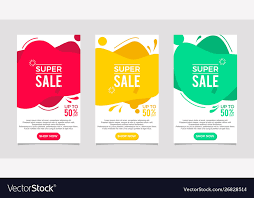

dynamický banner/slider obsahuje "action button" odkazuje priamo prepojením na akciu

**Slider** musí obsahovať tzv. "Ation Button"(aj "Swipe Up!"), **banner** (statický banner) neobsahuje **žiadny** "Action Button", **len banner** **hovorí**, ale **slider ukazuje**/odkazuje. 

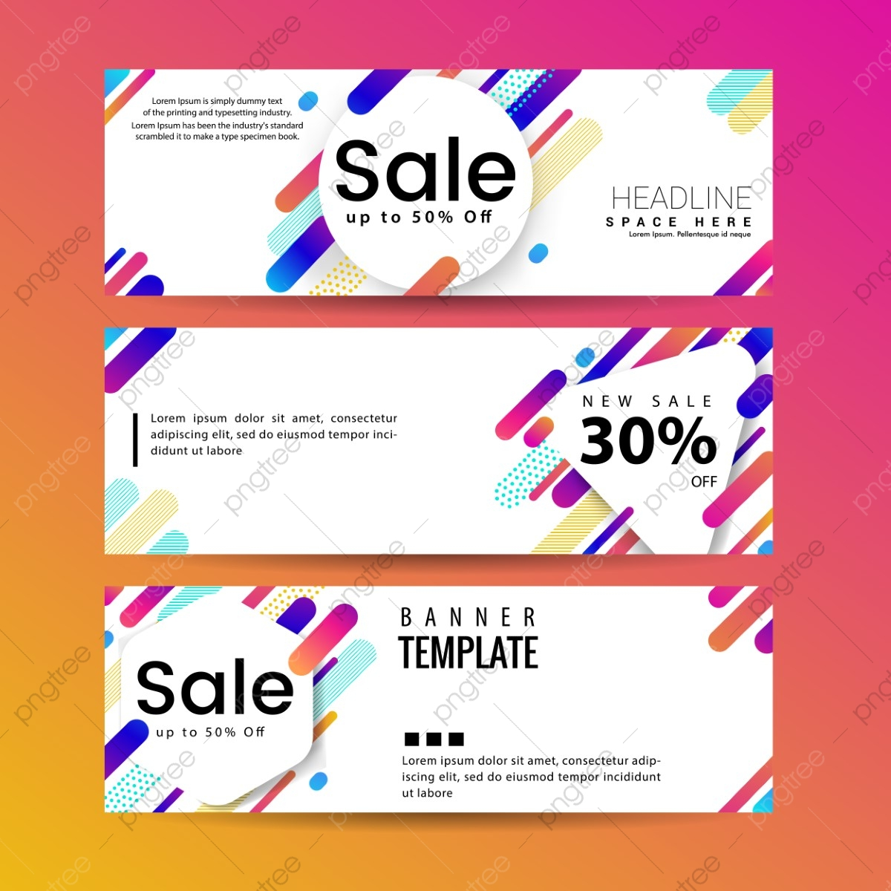
statický banner neobsahuje žiadne tlačidlo - "action button"

## **Typografia webu vs tlače**

**Písmená** s **pätkami** sa stali štandardnými písmenami pre tlač a používali sa po stáročia, takže keď Gutenberg navrhol tlačiarenský lis s pohyblivým písmom, knihy boli vytlačené písmenami s pätkami.

Dokumenty určené na tlač by mali byť vytlačené prevažne **písmom pätkovým**, hoci nejde o dogmu. Má sa za to, že serify pri čítaní na papieri uľahčujú orientáciu v texte a fungujú ako záchytné body pre oko. Taktiež by sa malo **pätkové písmo** používať pri vytváraní blogov.

Serify (pätky) sa na monitoroch s menšou hustotou pixelov na palec sa horšie čítajú, preto by sa mali použiť na väčšie písmo, napr. na nadpisy

**Bezpätkové fonty** je vhodné ich použiť na všetky typy textov tlačené aj digitálne. Ich elegantný vzhľad dokonale ladí s moderným webovým dizajnom a pokiaľ ide o webové články, ich absencia pätiek umožňuje čistejší text a **zvýšenú čitateľnosť**.

**Bezpätkové písmo** je vhodné najmä pre webstránky alebo digitálnu grafiku, kde nie je potrebné čítať veľa textu. **Bezpätkové písmo** má, ale aj svoje uplatnenie pri tlači. Hodí sa pre nadpisy, podnadpisy, názvy kapitol alebo pätičky stránok papiera.

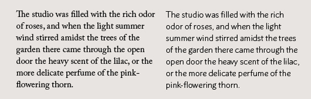

## **Responzívny web design**

### **Pravidlá responzívneho web designu** 

V 21. storočí nenavštevujeme internet len prostredníctvom počítačov ,ktoré sú len od jednej značky, teda s minimálnymi rozdielmi vo veľkostiach a monitorov. Prístup k internetu a najmä k rôznym web stránkam máme z rôznych zariadení ,ktoré sa odlišujú spôsobom fungovania a zobrazovania informácií. A preto je dôležité zabezpečiť aby sa informácie každému používateľovi zobrazovali rovnako prehľadne a efektívne na akomkoľvek zariadení.
 
Aby sme toho mohli docieliť ,web musí byť responzívny a teda taký ,čo sa prispôsobuje. Základnými pravidlami sú:

#### **Relatívne jednotky** 

Využívame relatívne jednotky a nie priamo pixely, centimetre, milimetre ,ale miery ,ktoré budú priamo vypočítané z celkovej šírky a dĺžky obrazovky, nazývajú sa EM a REM.

### **Flexibilné mriežky**

Prvky stránky ukladáme pomocou CSS do stĺpcov. Medzery medzi nimi by sme mali nastaviť relatívne. Objekty vkladáme relatívne ,teda využívame percentuálne hodnoty z celkovej šírky alebo vytvoríme „ukážkovú“ stránku a od nej zväčšujeme alebo zmenšujeme miery v závislosti od obrazovky.
    
    #wrapper {width:95%;  margin: 0 auto; }
    #header {width:100%; }
    #content {width:100%; }
    #sidebar {width:100%; }
    #footer {width:100%; }

    // Malé zariadenia (landscape phones, 576px and up)
    @media (min-width: 576px) {

    // Stredné zariadenia (tablets, 768px and up)
    @media (min-width: 768px) {
    #wrapper {width:90%;  margin: 0 auto; }
    #content {width:70%; float:left; }
    #sidebar {width:30%; float:right; }

    // Veľké zariadenia (desktops, 992px and up)
    @media (min-width: 992px) { ... }
    }

    //Veľmi veľké zariadenia (large desktops, 1200px and up)
    @media (min-width: 1200px) {
    #wrapper {width:90%;  margin: 0 auto; }
    }

### **Nevyužívame „nespratný“ obsah**

Objekty ,ktoré používame na stránke (obrázky, animácie, videá, estetické prvky ...) by nemali vyžadovať príliš veľkú zobrazovaciu plochu na to aby sa ukázali /fungovali správne. Napríklad nevyužívame obrázky ,ktoré vyzerajú dobre len ak sú zobrazené na veľmi veľkej ploche.

### **Rozdelenia obsahu**

Obsah je predom určený nami ako sa bude rozdeľovať/rozťahovať vzhľadom na dostupnú plochu a nie pomocou systému.

### **Upravené prvky**

Všetky prvky ,ktoré chceme vložiť na stránku predom skontrolujeme a ak je potrebné, upravíme tak, aby aj po zmene ich veľkosti spĺňali svoju úlohu.

### **Interaktívne prvky**

Prvkom ,ktoré sú príliš malé a majú medzi sebou nedostatočné medzery by sme sa mali vyhnúť. Na zariadeniach s kurzorom je možné s takými prvkami fungovať ,ale na dotykových zariadeniach by nebolo umožnené pohybovanie sa po stránke.

### **Prispôsobivosť stránky**

Na stránke by sme mali vytvoriť možnosť skryť a zobraziť obsah (napríklad pomocou rolovacích líšt), tak aby sa užívateľ mohol dostať aj k menej dôležitému obsahu bez toho aby mu „zbytočne“ prekážal pri tom dôležitom.

### **Začínať od najmenšieho**

Web  najprv vytvárame na čo najmenšom zariadení a postupne ho prispôsobuje väčším zobrazeniam, aby sme založili stránku na obsahu a najdôležitejšie informácie ostali zachované pri akomkoľvek zobrazení.

### **Testovať**

Konečné rozloženie stránky testujeme prostredníctvom rôznych aplikácií, kde len upravujeme veľkosť obrazovky, na ktorej by bol web zobrazený. Aby sa mohli posledné chyby odstrániť.

## **Optimalizácia obrázkov**

Originálne a jedinečné by nemali byť len texty na web stránke, ale aj obrázky. Autentické fotky by mali byť v dostatočnej **kvalite**, t.j. **ostré**, **svetlé**, s dodržaním zásad kompozície a v dostatočnom **rozlíšení**. Takéto fotky zvyšujú dôveryhodnosť stránky.

### **Rozlíšenie**

Každý obrázok má svoje rozlíšenie, vyjadrené v **pixeloch**. Ak chceme nastaviť správne rozlíšenie obrázka, najprv potrebujeme vedieť, kde ho použijeme. Ak to bude v imidžovej hlavičke stránky, ktorá sa zobrazuje na celú šírku obrazovky, môžeme zvoliť **väčšie rozlíšenie**, napríklad 2560px.

Pri ostatných obrázkoch, ktoré sa zobrazujú len na šírku článku, si vystačíme s nižším rozlíšení, napríklad 850px na šírku.

Ak ale chceme, aby na obrázok mohol používateľ kliknúť a zobraziť si väčší náhľad, použijeme **vyššie** rozlíšenie.

Optimálne veľkosti obrázkov pre produkty, články a fotogalérie sú rôzne:

- produktové obrázky – 600-900 px (väčšinou používame štvorcové formáty)
- obrázky do sliderov/pozadia – na šírku 1920 px
- obrázky článkov (ilustračné vs. informačné) – 600-900 px pre ilustračné fotky, väčšie rozlíšenie pre obrázky dovysvetľujúce/doplňujúce obsah
- obrázky fotogalérii – od 900-1200 px na šírku

### **Veľkosť**

Ideálne je, ak majú obrázky produktov a článkov do **100 kb**.
Fotografie v galériách do **150 kb** a obrázky v slideroch a na pozadí môžu mať aj **do 300 kb**. Veľkosti sú len **orientačné**, nie vždy sa dá dosiahnuť optimálna veľkosť.
Tá závisí od rozlíšenia, počtu farieb a detailov na obrázku. Platí tu priama úmera, čím väčšie rozlíšenie/počet farieb/detailov na fotkách, tým väčší dátový objem.

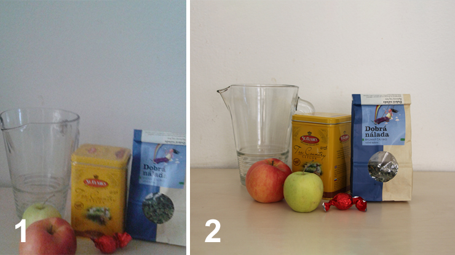

Na obrázku je príklad toho, ako by obrázky použité na web stránke nemali vyzerať (obrázok č.1 – zlá kompozícia, nezaostrené, zlé osvetlenie, fotené na výšku) a ako by obrázky vyzerať mali
(obrázok č.2 - ostré, svetlé, s dodržaním zásad kompozície a v dostatočnom rozlíšení).

### **Použitie CDN**

CDN je po anglicky skratka pre *Content Delivery Network*. Vďaka použitiu CDN vaši klienti z iného kontinentu načítavajú obsah vašej stránky zo servera umiestneného bližšie ku nim. CDN je skupina serverov umiestnená v rôznych geografických polohách za účelom zrýchlenia načítania obsahu, napríklad z webovej stránky. Jednou z hlavných úloh CDN je znížiť tzv. **latenciu**.

**Latencia** je oneskorenie, doba odozvy, je to doba, počas ktorej putujú data medzi serverom a prehliadačom návštevníka.

## **Farby a štýly**

### **UX**

UX je skratka zo slovného spojenia **User Experience**, čo v preklade znamená **užívateľská skúsenosť**. Jednoducho povedané, je to to, čo človek zažíva pri návšteve vašej webovej stránky, e-shopu alebo Facebook či mobilnej aplikácie. Či dokáže jednoducho nájsť informácie na vašom webe, objednať si u vás tovar bez problémov, alebo zahrať si vašu hru bez nadávania na vás.

### **UI**

UI je skratka zo slovného spojenia **User Interface**, čo v preklade znamená **užívateľské rozhranie**. Jednoducho povedané, je to to, ako vaša webová stránka, e-shop, Facebook alebo mobilná aplikácia vyzerá, ako sú jednotlivé prvky a elementy navrhnuté, ako interagujú medzi sebou a užívateľom.

### **UX vs UI**

Ak by sme mali skratky UX a UI vysvetliť na reálnom svete, môžeme si pomôcť reštauráciou. User Interface je v reštaurácii príbor, taniere, poháre, stoly a stoličky a User eXperience je jedlo, kvalita obsluhy, rýchlosť obsluhy a všetko, čo s tým priamo súvisí.

### **UX dizajn**

Úlohou UX dizajnéra je navrhnúť taký dizajn produktu alebo služby, ktorý dokáže priviesť návštevníka alebo zákazníka k vopred stanovenému cieľu bez akéhokoľvek problému. Návrh musí byť nielen **funkčný** a **použiteľný**, ale taktiež **estetický** a **užitočný**. UX dizajn je zameraný na cieľového užívateľa, jeho potreby, ciele a technologické zručnosti.

### **UI dizajn**

Hlavnou úlohou dizajnu a architektúry užívateľského rozhrania je jednoduchosť a pohodlie používania vašej webovej stránky alebo aplikácie pre návštevníkov alebo užívateľov. Preto je potrebné pri navrhovaní dbať na niekoľko princípov:

- Zadefinovanie si koncového užívateľa
- Skúsenosti a vedomosti užívateľa
- Jednoduché a jednoznačné zobrazenie funkcií
- Rýchle zorientovanie sa návštevníka
- Pocit bezpečnosti
- Estetickosť návrhu
- Testovanie, testovanie, testovanie

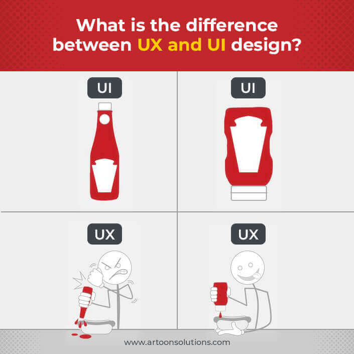

## **Základné pojmy ktoré sa používaju pri typografii webu**

### **Veľkosť**

Každé písmo je tvorené inak. Vždy to závisí od toho, aký zámer s ním jeho autor mal. Existujú písma tučné a široké, niektoré zase vertikálne natiahnuté a užšie. Text, ktorý je písaný rôznymi písmami, bude tiež potrebovať rôzne množstvo priestoru.

Výška znakov býva označovaná ako *x-height* (podľa písmena x). Ak využívate viacero písiem, je dobré, aby mali podobné hodnoty výšky písmen. Šírka jedného znaku sa nazýva *set widt*

### **Leading**

Leading označuje veľkosť priestoru, ktorý sa nachádza medzi základňami (angl. baseline) dvoch pod sebou nasledujúcich riadkov. Pojem má korene v časoch kedy sa jednotlivé riadky textu pri sádzaní oddeľovali pásmi olova (po anglicky lead). Dobre čitateľný text by mal mať leading väčší, ako je veľkosť písma. Obvykle asi 1,5 krát.

### **Kerning**

Pri kerningu ide o nastavenie medziznakových medzier. V zásade tak, aby vznikol dojem určitej vizuálnej rovnováhy.

### **Measure**

Týmto pojmom sa nazýva šírka celého textového bloku v rámci layoutu. Pre dobrú čitateľnosť a prehľadnosť na strane ide o veľmi dôležitý aspekt.

### **Hierarchia**

Predstava, že by všetky písma a text boli rovnako veľké, je určite nepríjemná. Okrem stereotypného vzhľadu, by bolo ťažké rozlíšiť  jednotlivé informácie a aj to, ktoré sú tie najdôležitejšie. Práve na to slúžia headliny, subheadliny a telový text.

### **Farba**

Farby sú dôležitou súčasťou tvorby webovej stránky. Úzko súvisia s typografiou. Dôležitý je hlavne kontrast. Málo kontrastný text bude na monitore počítača zle čitateľný a návštevníka skôr odradí ako zaujme. Stará dobrá klasika *„čierne na bielom“* je veľmi dobrým a jednoduchým spôsobom ako vytvoriť vhodný kontrast farieb.

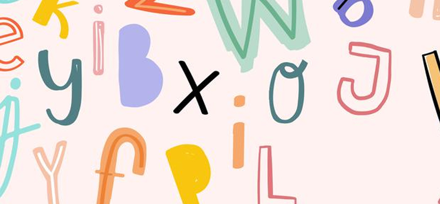

### **Tlačidlá**

Tlačidlá alebo buttony nám slúžia na presmerovanie na inú časť webu alebo iné webové stránky. Preto by tieto prvky **mali byť výrazné**. Ich výraznosť môžeme dosiahnuť rôznymi spôsobmi, ako veľkosť, farba, typ písma v tlačidle, prípadne jeho efekt pri prechádzaní myšou. Takisto tlačidlá by mali mať svoju vizuálnu identitu, to znamená dodržiavať ich vizuálny štýl po celom webe.

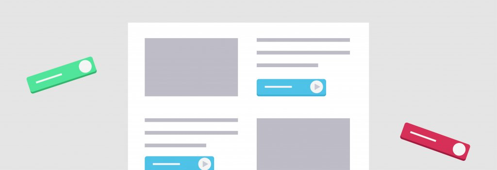

## **Ako na mobile ?**

Už bolo spomenuté ,že používame rôzne zariadenia ,ktoré sú odlišné vo fungovaní a zobrazovaní informácií. Jedným typom z takýchto zariadení sú mobily. 

Oproti počítačom a notebookom web stránky sa zobrazujú úplne inak, pretože musíme vložiť takmer rovnaký obsah do podstatne menšej obrazovky. Ako to spravíme ?

### **Vypustenie obrázkov**

Pri prispôsobovaní webu pre mobilné zariadenia sa snažíme odstrániť obrázok či fotky ,ktoré nie sú dôležité a sú iba estetickým prvkom.

###	**Rozloženie obsahu**

Ak nechceme aby používateľ opustil web už po pár sekundách, pretože nenašiel niečo, čo hľadal musíme upraviť dôležité informácie tak aby boli dostupné už po pár klikoch. Sú to informácie ,ktoré bežne zaujímajú používateľa. Napríklad v reštaurácii by sme najskôr hľadali otváracie hodiny, ponuku, adresu a podobné veci namiesto dokumentov. Podľa toho upravíme obsah.

### **Zjednodušenie webu**

Ak si otvoríme stránku na mobile, informácie by mali byť poukladané tak, aby mali dostatok priestoru. Prvky neusporadúvame vedľa seba, pretože to vyvolá chaotický pocit ,ale skôr sa ich snažíme dávať pod seba ,aby bola každá časť webu prehľadná a ničím nerušená alebo prekrývaná .

### **Prehľadnejšia navigácia**

Menu a navigácia by mala byť prispôsobená dotykovým obrazovkám. Teda by mali byť dodržané odstupy a primerané veľkosti klikateľných tlačidiel a odkazov.

### **Primerané efekty a decentný dizajn**

Na veľkých obrazovkách môžu 3D efekty, tiene a zložitejšie dizajny vyzerať dobre, no na mobilných zariadeniach kde sa snažíme dostať do popredia tie najdôležitejšie informácie by mohli byť takéto efekty len na škodu a zaberať priestor ,ktorého je nedostatok. Teda sa snažíme o plochý dizajn.

### **Čo je podstatné a čo nie ?**

Pri vytváraní webu by sme mali brať ohľad na to, aké informácie sa budeme snažiť poskytnúť. Nie len pri weboch, ale aj vo všetkých iných oblastiach sú vyžadované stručné informácie a ich jednoduchá dostupnosť. Je veľa rôznych spôsobov ako zobrazovať informácie na webe. Niektoré sú vytvorené tak, aby sme sa iba posúvali dole, iné web stránky majú rozsiahle menu a ku každej podstránke sa dostávame prostredníctvom neho. Taktiež je rozdiel v tom aké informácie nám web podáva a je potom aj rozdiel v tom čo je dôležité a čo nie.

### **Kde zobrazujeme to dôležité a kde to menej podstatné ?**

#### **Hlavná stránka**
Takmer každý web má svoju hlavnú/úvodnú stránku. Tu by mali byť umiestnené tie najdôležitejšie informácie (ktoré záležia od témy stránky) a menu/navigácia. Na túto stránku sa najčastejšie dostane používateľ ako prvú. To znamená ,že v prvých slidoch by sme mali zobraziť to, na čo sa stránka zameriava, aký je jej cieľ. Nepoužívame tu veľa textu a ak potrebujeme ešte niečo doplniť k tej hlavnej informácii, tak to urobíme prostredníctvom odkazov, ktoré nás odkážu/ presmerujú na inú podstránku.

#### **Podstránka**
Na podstránku sa dostaneme napríklad z navigácie alebo z odkazu z inej podstránky alebo hlavnej stránky. Úvodná sekcia by mala ukazovať čo sa nachádza na tejto podstránke. Ak sa tu nachádza viacero prvkov, znova ich neupresňujeme, neudávame bližšie informácie , ale odkážeme sa na inú podstránku prostredníctvom odkazu. Slidy by mali byť zoradené od tých najdôležitejších prvok po tie menej. Napríklad v e-shope produkty bývajú zoradené podľa nejakých vlastností .

## **Stránka čo ide s trendami**
Internet je preplnený informáciami ,ktoré sú podávané prostredníctvom webstránok. Nezáleží či si chceme spravovať bankový účet, spoznávať ľudí na sociálnych sieťach alebo si len objednať oblečenie, vždy to je cez nejakú webstránku. Ak chce spoločnosť, skupina, alebo jednotlivec aby jeho stránka bola čo najviac navštevovaná, nezáleží len na tom aké kvalitné informácie, služby ponúka ale aj aký je dizajn prepracovaný a úhľadný. A čo to je ten dizajn ? Je to to ako stránka vyzerá, jej celkový vzhľad, do akého štýlu je robená. Dizajn môže byť tvorený rôznou škálou farieb, obrázkov, fotiek, animácií (jednoduchých krátkych kreslených videí ), fontov (typy písma), 3D objektov ( trojrozmerných telies) a mnohých iných prvkov .Všetok obsah na webe je tvorený najčastejšie pomocou programovacích jazykov HTML a CSS. Html slúži na vloženie informácie a CSS tomu udá nejaký konkrétny vzhľad.

**Ako vyzerali weby od jeho začiatku ?**

Na začiatku tvorby webov, okolo roku 1990 bolo prioritou zobraziť informácie. Stránky neboli takmer nijako dizajnové. Neboli využívane viaceré fonty, informácie neboli ukladané do žiadnych objektov, pozadie bolo jednotné.

Po vynájdení jazyku CSS sa tvorcovia stránok snažili využiť CSS naplno. To ako stránka vyzerá začalo byť dôležitou súčasťou webstránok. Pri vytváraní sa snažili používať rôzne 3D efekty, tiene, odlesky, zaoblené rohy a tak ďalej.

**Aký štýl je preferovaný dnes ?**

Väčšina obľúbených stránok je vytvorených do minimalistického štýlu s plochými prvkami. Autori sa snažia nedávať zbytočne veľa efektov, tieňov, typov fontov, farieb. Riadia sa pravidlom menej je niekedy viac a to platí aj pri upravovaní jednotlivých prvkov na stránke, ktoré sú väčšinou  ploché. Teda nemajú žiadne tiene a odlesky. Na moderných stránkach nenájdeme preplnené slidy (časti stránky) a preferuje sa jednotný vzhľad aj usporiadanie.  
